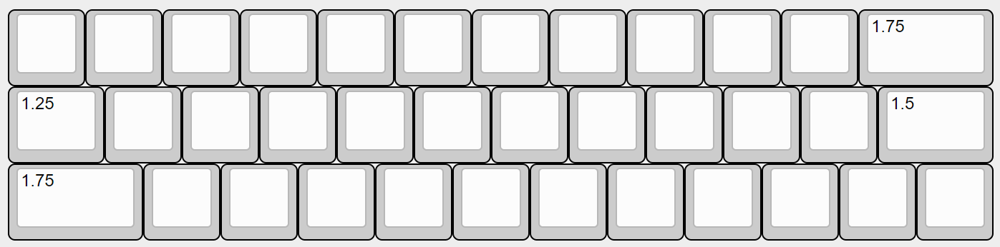
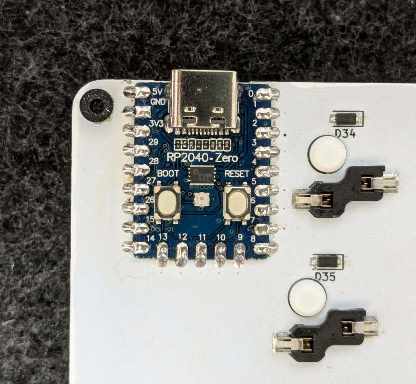

# Neige試作版ビルドガイド

## 1. 本書について

本書は[天キーVol.8](https://tenkey.connpass.com/event/349566/)で少量配布した自作キーボードNeigeキットの試作版ビルドガイドです。

試作品かつ難ありのため、経験者向けとし、簡潔な記載としています。

- 試作基板は設計ミスによりRP2040-Zeroの取り付け向きが本来意図と異なります。そのため必要な足の長さが本来よりも長く、最終的に作られる製品版ケースとの互換性がありません
- スイッチプレートにUSBコネクタとの干渉避け切り欠きがありません。が、1点目のミスの結果、USBコネクタ位置が下がり干渉しない状態になっています
- シルク印刷が開発コードのままになっています

## 2. 準備

### 2.1 内容物の確認

|番号|品目|数量|
|---|---|---|
|1|Neige スイッチプレート|1枚|
|2|Neige メイン基板|1枚|

### 2.2 別途用意が必要な部品

下記は本キットに含まれません。国内外の自作キーボード専門店や電子部品販売店などから別途調達してください。

|品目|数量|備考|
|---|---|---|
|Waveshare RP2040-Zero|1|互換品は部品配置が異なる場合があり、基板の切り欠きと干渉することがありますので利用にはご注意ください|
|1N4148W ダイオード|36|SOD-123パッケージを想定|
|Kailh Choc用スイッチソケット|36||
|Kailh Choc V2 Full POM互換スイッチ|36|Lofree Flow向けとして知られるスイッチ。元祖？Choc V2スイッチとは仕様が異なるため互換性はありません|
|MX互換キーキャップ|必要数|上記スイッチで利用可能なもの。キーピッチはフルサイズ（19.05mm）なので、高さ方向だけ注意|
|足用のスペーサーやネジ、ゴム足|4セット|お好みに応じて。足の高さは4mm以上必要です。基板のしなりを考慮して5mm程度にしておくと安心です

### 2.3 適合するキーキャップサイズ

下図の通りのキーキャップが必要です。

## 3. 組み立て

### 3.1 RP2040-Zeroの動作確認とファームウェアの書き込み

下記からファームウェアを入手し、RP2040-Zeroに書き込んでください。

[https://github.com/ymkn/neige/releases/download/v0.1/ymkn_neige_vial.uf2](https://github.com/ymkn/neige/releases/download/v0.1/ymkn_neige_vial.uf2)

### 3.2 ダイオードとスイッチソケットのはんだ付け

基板裏面のシルク印刷に合わせてはんだ付けしてください。ソケット、ダイオードともに向きがありますので注意。

### 3.3 RP2040-Zeroのはんだ付け

ウラ面側にボタンが来る向き（1番ピンが右上）で、ウラ裏面側にはんだ付けをしてください。

> [!NOTE] 試作基板の設計ミスにより、本来意図と取り付け向きが異なります

### 3.4 スイッチとキーキャップの取り付け

スイッチプレートの横方向に若干の余裕を持たせている関係で、基板に挿す前だとスイッチの固定が甘く感じるかと思います。挿してしまえばしっかり固定されますので気にしないでください。

### 3.5 足の取り付け

脚についてはスペーサーやゴム足などで適当に対応してください。試作基板においては最低4mmちょいあれば十分かと思います（RP2040-Zeroのボタンが一番出っ張っている部分なので、そこに干渉しない長さを確保する）。

基板の四隅にマウント用の穴（直径3.2mm）がありますのでご活用ください。

### 3.6 基板の保護

ウラ面は接点がむき出しの状態ですので、金属製の机で使うとショートする可能性があります。気になる場合はマスキングテープなどで保護するか、ボトムプレートを作成してください。

## 4. 使用

### 4.1 動作確認

コンピュータとNeigeをUSBケーブルで接続し、キーボードとして認識され、文字が入力できることを確認してください。

### 4.2 初期設定とキーマップのカスタマイズ

キーマップのカスタマイズは[Vial](https://get.vial.today/)にて行えます。

初期キーマップで使う場合は下記からキーマップ定義をダウンロードし、アプリ版のVialにて`File > Load saved layout`から読み込んでください。これによりTapDanceの定義やQMK Settingsが復元され利用可能になります。

[https://github.com/ymkn/neige/releases/download/v0.1/neige.vil](https://github.com/ymkn/neige/releases/download/v0.1/neige.vil)

## 5. その他

### 5.1 ブートモードの入り方

ブートモードに入るには、USBケーブルを切断してから、左上のキー（Tabキー）を押しながらUSBケーブルを接続します。

もしくは、USBケーブルを接続した状態でドーターボード上のBOOTボタンを押しながらRESETボタンを押します。
